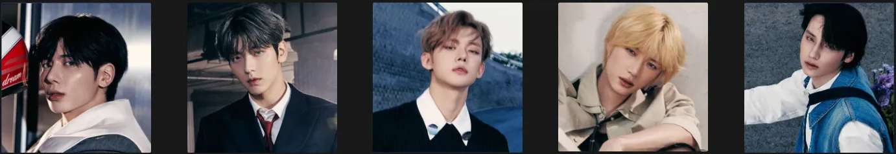
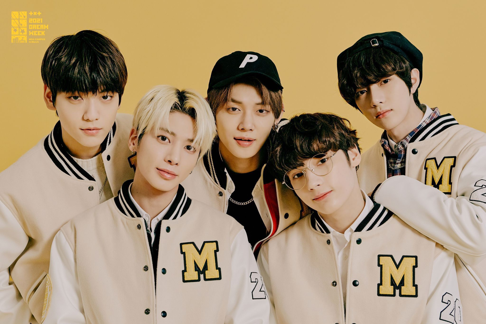
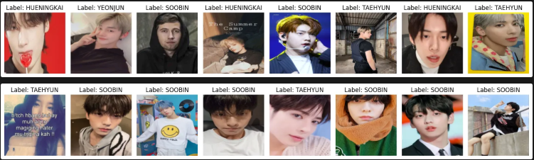
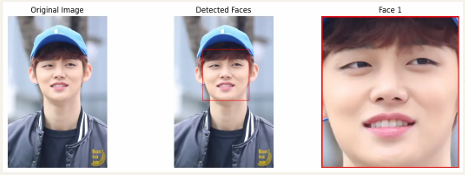
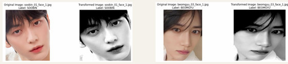
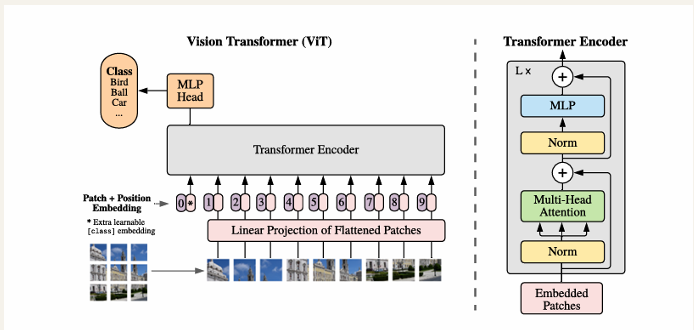
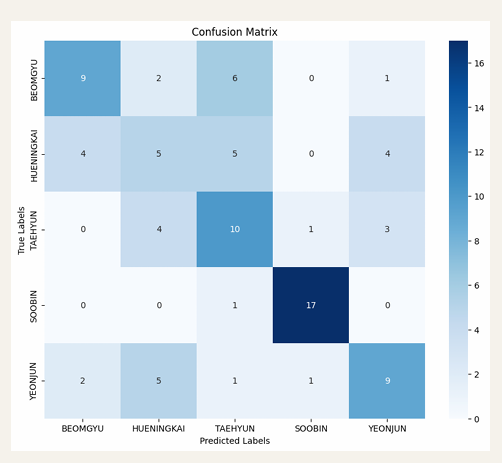
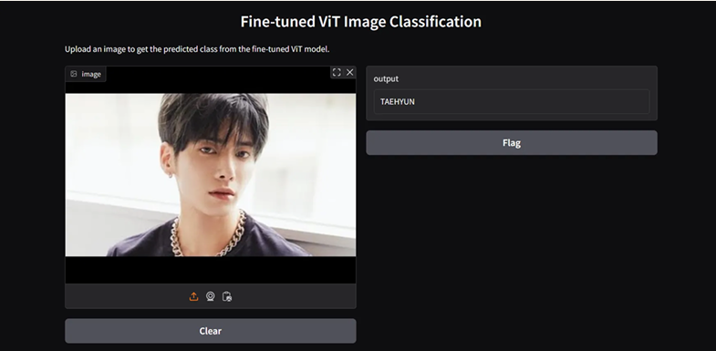

# K-Pop Idol Classification -- TOMORROW X TOGETHER (TXT)

## Project Overview

This machine learning project implements a facial recognition system specifically designed to classify K-pop idols from the group TOMORROW X TOGETHER (TXT). The project explores image classification capabilities using modern deep learning approaches while focusing on a domain of personal interest.

## Motivation & Background

This project emerged from several motivations:

1. **Personal Interest**: Passion for K-pop music and culture
2. **Technical Curiosity**: Interest in exploring practical applications of image classification
3. **Learning Opportunity**: Desire to gain hands-on experience with fine-tuning transformer models
4. **Practical Application**: Creating a useful tool for identifying different K-pop artists

## Implementation Process

### 1. Data Collection

- **Automated Crawling**: Utilized Bing image crawler to gather a large dataset of K-pop idol images
- **Manual Curation**: Filtered images to remove noise and ensure quality
- **Quantity Achievement**: Collected 50 high-quality images per idol
- **Time Efficiency**: Automated process allowed for quick accumulation of training data

### 2. Dataset Preparation & Preprocessing

- **Data Augmentation**: Rotated images left and right by 90° to expand dataset to 200 images per idol
- **Face Detection**: Implemented YOLOv8-Face-Detection from Hugging Face
- **Face Cropping**: Applied targeted cropping based on facial bounding boxes coordinates
- **Color Processing**: Tested grayscale conversion to reduce makeup and styling influences

### 3. Model Architecture & Fine-Tuning

- **Base Model**: Used Google's Vision Transformer (ViT) architecture
- **Pre-trained Foundation**: Started with `google/vit-base-patch16-224` model from Hugging Face
- **Custom Training**: Fine-tuned on our K-pop idol dataset
- **Experimental Approaches**: Tested multiple preprocessing combinations

## Experimental Results

### Preprocessing Impact Analysis

| Approach | Description | Test Accuracy |
|----------|-------------|---------------|
| Baseline | No preprocessing | ~60% |
| Face-cropped | Applied YOLOv8 face detection | ~75% |
| Grayscale | Color converted to grayscale | ~75% |
| Combined | Face-cropped + grayscale | ~85% |

### Model Performance Progression

| Model Version | Test Accuracy | Macro Precision | Macro Recall | Macro F1-Score |
|---------------|---------------|-----------------|--------------|----------------|
| Initial Model | ~60% | 0.632 | 0.594 | 0.597 |
| Face Detection & Cropping | ~75% | 0.694 | 0.675 | 0.677 |
| Grayscale Conversion | ~85% | 0.80 | 0.80 | 0.80 |

### Human vs. AI Recognition Study

I conducted a comparative analysis between human and machine recognition capabilities:

- **Survey Methodology**: Collected data from 10 participants
- **Confusion Matrix Analysis**: Created matrices for both human and AI predictions
- **Similarity Measurement**: Calculated cosine similarity between recognition patterns

| Recognition System | Accuracy | Precision | Recall | F1-Score |
|-------------------|----------|-----------|--------|----------|
| Human Participants | 55.6% | 0.554 | 0.556 | 0.555 |
| AI Model | 85.0% | 0.80 | 0.80 | 0.80 |

**Key Finding**: The AI model demonstrated higher recognition accuracy in this specific task domain.

## Demo Application

- **Technology**: Implemented using Gradio for interactive demonstration
- **Functionality**: Allows users to upload images for real-time classification
- **Usability**: Simple interface with clear results presentation
- **Deployment**: Currently running as a standalone application

## Challenges & Learnings

| Challenge | Learning |
|-----------|----------|
| Data Quality | Image crawling sometimes resulted in lower quality or irrelevant images requiring manual filtering |
| Model Training | First experience with developing custom image recognition models required significant learning |
| Preprocessing Impact | Discovered significant accuracy improvements through face detection and grayscale conversion |
| Cloud Integration | Challenges with model persistence and deployment using Google Cloud |

## Future Improvements

- **Web Development**: Full web application deployment with React
- **Dataset Expansion**: Include more idol groups and training examples
- **Real-time Analysis**: Implement video classification capabilities
- **Mobile Access**: Develop companion mobile application
- **Cloud Deployment**: Properly integrate with Google Cloud for sustainable hosting

## Technical Stack

| Category | Technologies |
|----------|--------------|
| Machine Learning Frameworks | PyTorch, Transformers |
| Computer Vision | YOLOv8 for face detection |
| Model Architecture | Vision Transformer (ViT) |
| Demo Application | Gradio |
| Planned Front-end | React |

## Author

[asu-bridge93](https://github.com/asu-bridge93)
---

*Thank you for your interest in this project!*